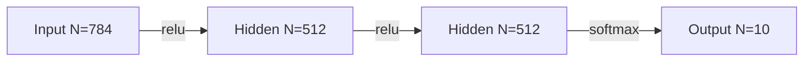
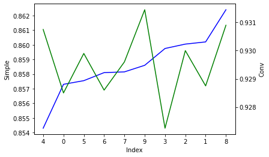
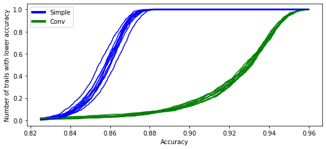
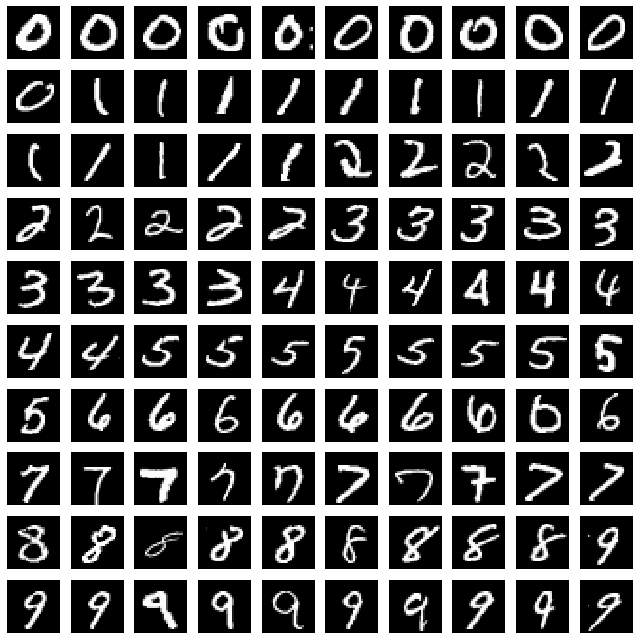
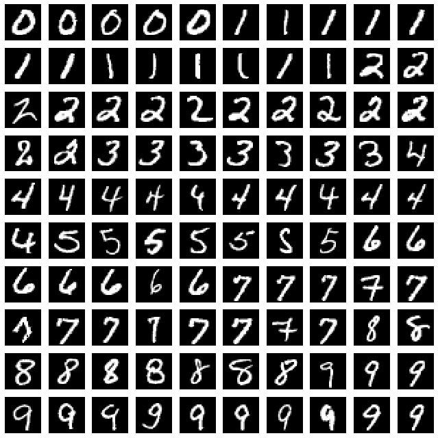

# First Experiment

Comparing the most important data partitions for a vanilla NN and a Convolutional NN.

## Two Models in this experiment:
These were both taken from here: https://colab.research.google.com/github/AviatorMoser/keras-mnist-tutorial/blob/master/MNIST%20in%20Keras.ipynb
### Simple

### Conv

## Experiment Summary
1. Take first 1000 training examples from `mnist.load_data()`.
1. Split them into 10 subsets leaving out a distinct set of 100 training examples each time [0-900, 0-800+900-1000, ... 100-1000].'
1. For each subset train the [Simple](#simple) Model and calculate the accuracy of the model over the test set.
1. Repeat the experiment 1000 times to try reduce the impact of randome errors.
1. Repeat for the [Conv](#conv) model. 

## Results
|Index|Subset|Median Accuracy Simple|Median Accuracy Conv|
|---|---------------|-------|----------
|0  |0-900          |0.8573 |0.9285
|1  |0-800+900-1000 |0.8602 |0.92875
|2  |0-700+800-1000 |0.86005|0.93
|3  |0-600+700-1000 |0.85975|0.92725
|4  |0-500+600-1000 |0.8543 |0.93075
|5  |0-400+500-1000 |0.85755|0.9299
|6  |0-300+400-1000 |0.8581 |0.9286
|7  |0-200+300-1000 |0.85815|0.9296
|8  |0-100+200-1000 |0.8624 |0.9309
|9  |100-1000       |0.8586 |0.93145

The following graph shows the same data but ordering the training subsets by the Simple Models accuracy.

||
|:--:|
|Figure 1|

Plotting the CDF of the results:
||
|:--:|
|Figure 2|

## Comments
### (Lack of) Correlation
 The relative performance of the Simple Model with a given training set was not a good predictor of the relative performance of the Conv Model on the same training set. My interpretation of this is what "good" training data is varies between the two Models. One explanation is that for the MNIST dataset a CNN implicitly pushes the model towards some sort of translation invariance and so having examples of the characters translated in the training set my be less important to the Conv model rather than the Dense Model.
 

### Variation
The distribution of results within a single training set was wider for the Conv Model than the Simple Model. i.e. the influence of training Data vs random starting conditions had a bigger impact on the conv model. 

The CDF for the Conv model is much less steep this means that there was alot more variation between the runs of the same model i.e. the initilization of the network had a bigger impact on Conv vs Simple.

The comparing the CDF between the training subsets is also much wider for the Simple Model vs the Conv Model. We can clearly see the worst and best performing training sets (indecies 4 and 8 respectively). I interpret this as the training data makes a bigger impact on the Simple Model vs the Conv Model. It may be that this was just because the Conv Model had higher performance to start with so a single training example had a smaller impact. TODO rerun the experiment with a conv training size that leads to ~85% accuracy. 

Are the differences between the performance on the same model on the different subsets of the training data statistically significant? Out of the possible 45 pairwise comparisons 32 of the differences were statistically significant for the Simple model but only 13 for the Conv Model (using a p of 0.05).  

The lowest result across all trails was much lower for the Conv model than the Simple Model (0.6116 vs 0.7899) which is made even more notable when you compare it to the median accuracy of the two models. 

### Performance

Performance delta between the two models is high. TODO Results as we vary the training set size.

## A look at the data

The training subset that had by far the biggest difference in relative value between the two models was the one that had index 4. Without this data missing from this training set the Simple Model performance deteriorates but the Conv model is fairly unaffected by its absence. 
This is the data that was missing from that subset:
||
|:--:|
|Figure 3| 

Both of the models performed well of the Training set at hte 8th index which is missing the following  
||
|:--:|
|Figure 4| 

The Conv model performed worst on the 3rd training set which is missing the following
||
|:--:|
|Figure 5| 

### Thoughts:
Needs cleaning up but:
- 3rd Subset has very few missing 0s but many missing 2s, 7s, 9s - maybe 0s are easy for the Conv model? Could look at the precision / recall for the various subsets.
- 4th Subset has some strange squashed characters vs 8th subset looks a) some of the data is very similar b) very clear what it is

## Analysis:
Anyone who wants to see in more detail the analysis done for this document can look here to see the simple source code used.
https://colab.research.google.com/drive/1vpotKIeAF5t_F4hENwq7t-onyyygBLIl?usp=sharing
 
## Next Steps
1. Do some analysis on training set 4 to see if the position invariance hypothesis is true.
1. CTRL-f TODO in this document.
1. Try different models from here http://yann.lecun.com/exdb/mnist/
1. Build a method to select the best data from one model and see if it carries over to another model. 
1. Compute something that works out average position / size / thickness / etc.